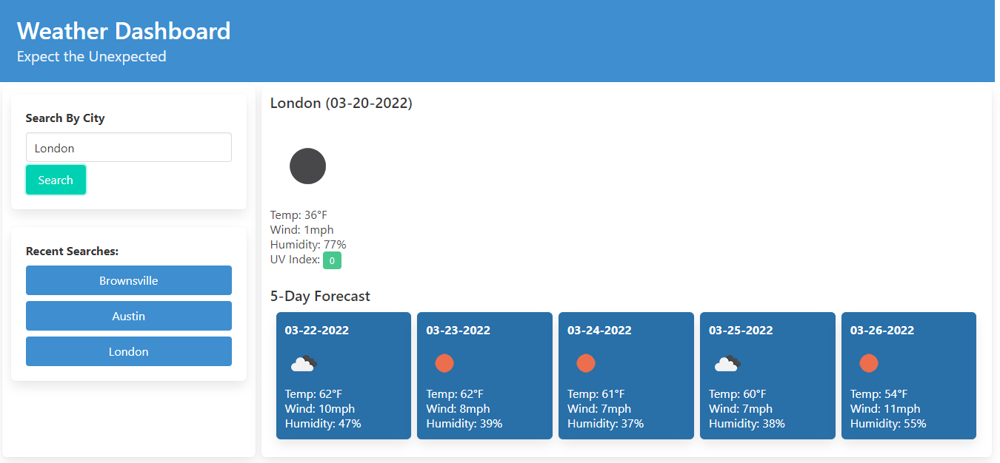

# Weather Dashboard

## Purpose
User Story: 
AS A traveler
I WANT to see the weather outlook for multiple cities
SO THAT I can plan a trip accordingly

## Table of Contents
1. [Github](#link-to-github-page)
2. [Description](#description)
3. [Built With](#built-with)
4. [Screenshot](#screenshot)

### 1. Link to Github Page
- You can find a link to the deployed application [HERE](https://jwhitney2209.github.io/weather-dashboard/) 

### 2. Description
- Create an app that allows a user to view the weather so that they can plan a trip
- App will help them see current and future weather to plan accordingly

### 3. Built With
- HTML
- Javascript
- jQuery
- Moment.js
- Bulma
- OpenWeather API
- CSS

### 4. Screenshot

